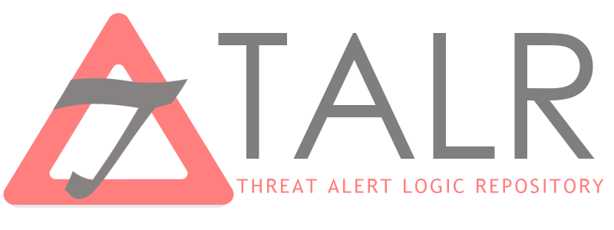
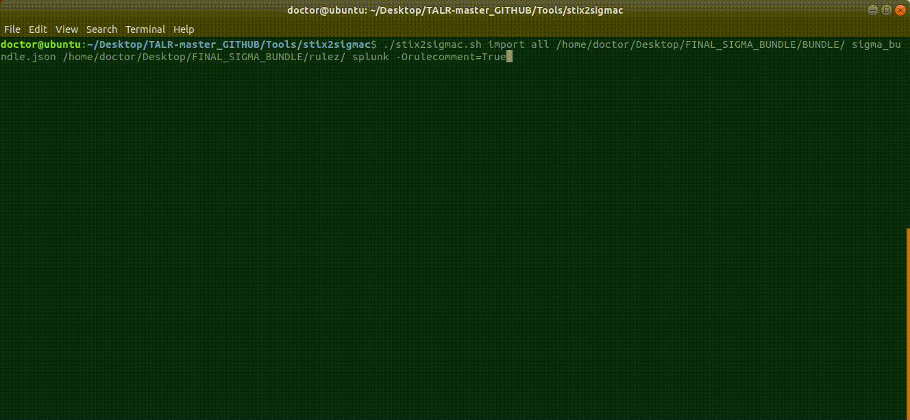

# Threat Alert Logic Repository (TALR)

A public repository for the collection and sharing of detection rules in platform agnostic formats. Collected rules are appended with STIX required fields for simplified sharing over TAXII servers.

Contains tools useful for translating from STIX to Sigma, and automating their ingestion/translation.

# TALR Vision

Sharing SIEM Rules via STIX/TAXII, which enables:
* Highly scalable sharing of SIEM rules by translating sigma style rules to STIX objects. This allows for sharing over TAXII.
* Tactical and informed response. By pulling down STIX objects related to SIEM rules that fired, you can inform your response based on the the Threat Actor, Campaign, TTP, indicators, etc. that may be related.
* Automated ingestion of new SIEM Rules by running new STIX bundles through stix2sigmac, and recieving new SIEM rules in the syntax of your choice.
* Benchmarking rules against similar organizations by sharing rules and intel over shared TAXII servers, keeping each other updated with observed and industry-specific SIEM content.
* Easier transition between SIEM vendors, as stix2sigmac organizes and stores a local copy of every rule run through it in sigma format.

# Using stix2sigmac
stix2sigmac will parse through a STIX bundle, locate the detection rules, store them locally in yaml, and translate them to the SIEM query syntax specified.

To test this, we have made 2 bundles available in the /Bundles directory.
- sigma_bundle.json - STIX bundle of entire sigma repository
- sra_bundle.json - STIX bundle of a sampling of SRA created sigma rules

To unpack these bundles, run stix2sigmac against them, using the following syntax:
```./stix2sigmac import [PRODUCT_TYPE or CATEGORY or SERVICE or ATTACK_TACTIC] [/DIRECTORY/WITH/STIX_BUNDLE/] [BUNDNLE_NAME.json] [/DIRECTORY/TO/PLACE_RULES/] [SIEM] [BACKEND_OPTIONS]```

For ```[SIEM]``` and ```[BACKEND_OPTIONS]``` options available, please refer to the [Sigma Tools page](https://github.com/Neo23x0/sigma/tree/master/tools). Note: If using multiple backend options, comma seperate.

Example Steps to use stix2sigmac to unpack a bundle: (Tested on Ubuntu 18.04.1 with all requirements installed)
1. Open a terminal session
2. Clone the repository ```git clone https://github.com/SecurityRiskAdvisors/TALR.git```
3. Change into the directory of the script ```cd /location/of/repository/Tools/stix2sigmac```
4. Give the script permission to execute ```chmod +x stix2sigmac```
5. Translate the rules in the command line and export to the location of your choice in sigma (additional examples can be found in the stix2sigmac readme in /Tools/) ```./stix2sigmac import windows ../../Bundles/ sra_bundle.json /LOCATION/OF/EXPORT/ splunk -Orulecomment=True```

Execution should look like this:


# Requirements:
Only required if using tools.
 
1. Python3 - required for pip
	```sudo apt-get install python3```
2. Pip - required to install the things
	```sudo apt-get install python3-pip```
4. JSON to YAML - required for stix2sigmac
	```pip3 install json2yaml```
5. sigmatools - required for stix2sigmac
	```pip3 install sigmatools```
6. OPTIONAL: figlet - For the intro banner
	```sudo apt-get install figlet```

# Goals:
* [X] Select SIEM rule sharing method (Tranlate to STIX, transport with TAXII)
* [X] Automate ingestion of SIEM rules from a STIX bundle (stix2sigmac)
* [ ] Create sample bundles for community use
* [ ] Develop bundling tool
* [ ] Publish public TAXII server for community testing

# Projects in use / Thanks:
* [Sigma](https://github.com/Neo23x0/sigma/)
* [STIX & TAXII](https://oasis-open.github.io/cti-documentation/)

# Contributors:
Nick Ascoli, Zachary Santoro, Brandon Martin, Tyler Fredrick, Kevin Foster

[Slides from "Keeping Up With the Joneses: SIEM Rules Edition](https://www.sans.org/cyber-security-summit/archives/file/summit-archive-1544034674.pdf)
